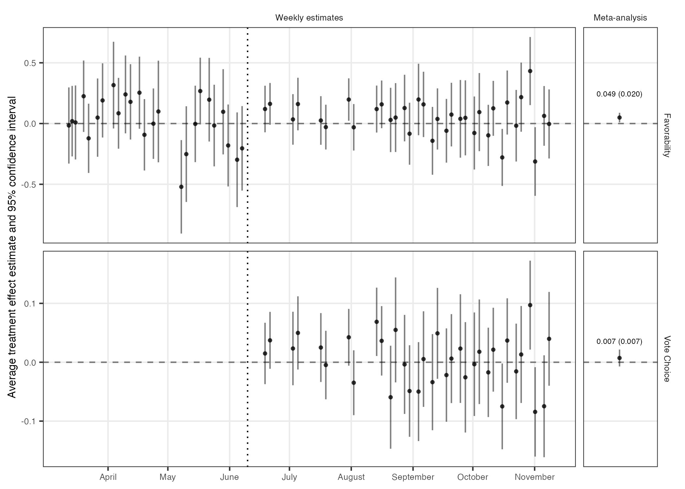
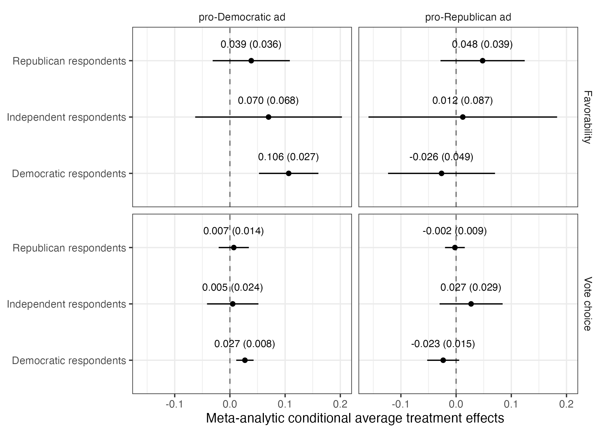
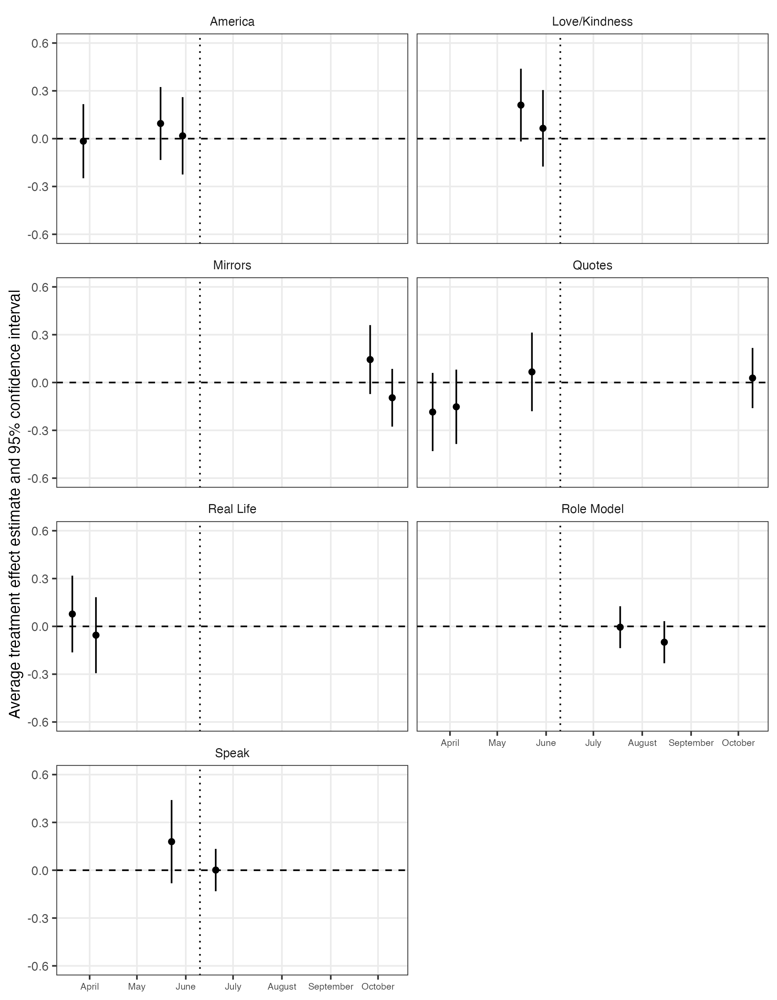

# Active Maintenance Report: coppock_hill_vavreck_2020

2026-08-01

- [Summary](#summary)
  - [Does the deposited archive run?](#does-the-deposited-archive-run)
  - [Does the maintained rewrite reproduce the
    paper?](#does-the-maintained-rewrite-reproduce-the-paper)
- [Paper overview](#paper-overview)
- [Original archive reproducibility](#original-archive-reproducibility)
  - [The archive overwrites its own
    deposit](#the-archive-overwrites-its-own-deposit)
  - [Checksums](#checksums)
- [Errata in the published article](#errata-in-the-published-article)
- [Number-by-number comparison](#number-by-number-comparison)
- [Maintained rewrite](#maintained-rewrite)
  - [Architecture](#architecture)
  - [Confidence bounds that lost their
    labels](#confidence-bounds-that-lost-their-labels)
  - [Deprecated patterns replaced](#deprecated-patterns-replaced)
  - [Table 1 without the texreg
    workaround](#table-1-without-the-texreg-workaround)
- [Meta-analysis: rmeta to metafor](#meta-analysis-rmeta-to-metafor)
- [Figure verification](#figure-verification)
  - [A layout that stopped
    reproducing](#a-layout-that-stopped-reproducing)
- [Maintained rewrite verification](#maintained-rewrite-verification)
- [R environment](#r-environment)

*Drafted by Claude Opus 5 under the supervision of Alex Coppock.*

This repository holds the actively maintained replication code for
Coppock, Hill and Vavreck (2020), together with the reproducibility
report that documents what the original archive did and did not do. It
is part of a program applying the maintenance proposal in Peer, Orr and
Coppock (2021, *PS: Political Science & Politics*, doi
[10.1017/S1049096521000366](https://doi.org/10.1017/S1049096521000366))
to a set of published archives.

|  |  |
|----|----|
| Article | [10.1126/sciadv.abc4046](https://doi.org/10.1126/sciadv.abc4046) |
| Replication archive | [10.7910/DVN/TN7KWR](https://doi.org/10.7910/DVN/TN7KWR) |
| Pre-analysis plan | None |

**The data are not redistributed here.** The deposit is 9.5 MB across 21
files and lives at Harvard Dataverse, which is the only copy this
repository points at. `download_original.R` fetches it and verifies
every file; `original_manifest.csv` pins the file identifiers, sizes and
checksums, so the exact bytes this code was written against are recorded
in version control even though the bytes themselves are not.

**Repository layout.** `maintained/` is the maintained rewrite: one
script per published table or figure, writing to `output/`, which is
committed so a reader can compare a fresh run against it without
downloading anything. `ground_truth/` ties every published number to the
code that produces it. `original/` is created by the download script and
is deliberately absent from the repository. This file is the
reproducibility report, also available as a PDF in `report/`.

**License.** CC0 1.0 Universal, matching the terms of the deposit this
repository maintains. See `LICENSE`.

**To reproduce.** Clone or download the repository, open
`coppock_hill_vavreck_2020.Rproj`, and run:

``` r
source("run_all.R")
```

That fetches the deposit, verifies its 21 files, produces every table
and figure into `maintained/output/`, and rebuilds the ground truth
table from those outputs. Required packages: tidyverse, estimatr,
metafor, modelsummary, janitor, broom, knitr, kableExtra, here. Paths
resolve through `here`, so nothing depends on the working directory. The
full run takes about ten seconds once the deposit is on disk, most of it
in the four estimation scripts, which fit more than a thousand weighted
regressions across weeks and partisanship-by-battleground subgroups; the
first run also fetches 9.5 MB from Dataverse. A successful run
overwrites `maintained/output/`, which is committed: **`git diff` on
that folder is the reproduction check.**

# Summary

Two questions, answered before the detail.

## Does the deposited archive run?

Not any more, and the failure is silent about how much it costs. The
four `estimate_*.R` scripts that build every intermediate estimate file
end in `write_rds(x, path = "...")`. The `path` argument was
soft-deprecated in readr 1.4 and removed in readr 2.2, so all four now
stop with `argument "file" is missing, with no default` after the
regressions have run. Changing `path =` to `file =` is the whole fix,
and with it every script in the deposit runs to completion and
reproduces its own deposited output object exactly.

What makes the failure quiet is that the eight downstream scripts do not
notice. The archive deposits the four `.rds` estimate files alongside
the code that makes them, so `table_1.R`, `figure_1.R`, `figure_2.R`,
`table_S2.R` and the rest read the deposited objects and run clean
whether or not the estimation step succeeded. An archive that ships its
own intermediates can look healthy while the half of it that does the
work has stopped executing.

Reproducing is a different question from running, and here the archive
does reproduce. Of the 175 published quantities recorded in the ground
truth, 165 are reproduced exactly by the deposited code once the four
`path =` calls are repaired. The 10 that do not match are not failures
of the code: they are places where the article or its appendix states
something the code does not produce, listed under the errata section
below.

## Does the maintained rewrite reproduce the paper?

Yes. All 165 reproducible quantities match the published values to
reported precision, and the 10 that do not are the same published errata
the archive fails on. The rewrite also agrees with the deposit itself.
Its four per-week estimate files are the objects the archive deposits
alongside its code, and they are the input to every published table and
figure; across all 651 estimates in them the largest disagreement is
4.3^{-15}, which is floating-point noise.
`maintained/text_archive_agreement.R` measures that and writes it out,
so the claim is a number in `output/` rather than a sentence here.

The rewrite also removes the archive’s one genuinely fragile dependency.
The published pooling runs through `rmeta`, which has not been updated
since March 2018 and which the archive props up with hand-written
`tidy()` and `glance()` methods in its own `helpers.R`. The rewrite
pools with `metafor` instead, which supports `broom` natively, so both
the package and the glue holding it together are gone. No pooled
estimate moves.

# Paper overview

**Citation**: Coppock, A., Hill, S. J. and Vavreck, L. (2020). “The
small effects of political advertising are small regardless of context,
message, sender, or receiver: Evidence from 59 real-time randomized
experiments.” *Science Advances*, 6(36), eabc4046. DOI:
10.1126/sciadv.abc4046

**Summary**: Forty-nine real 2016 presidential campaign advertisements
were tested in 59 advertisement-by-week experiments on 34,000 YouGov
respondents across 29 weeks, from the primaries through election day.
Each week a fresh national sample was assigned at random to watch one of
that week’s advertisements, both of them, or a placebo advertisement for
car insurance, and then answered a short survey. Treatment effects are
estimated week by week with covariate-adjusted weighted least squares
and robust standard errors, then pooled by random-effects meta-analysis.
The average effect on target candidate favorability is 0.049 scale
points on a five-point scale and the average effect on vote intention is
0.7 percentage points. The paper’s argument is about heterogeneity
rather than about the averages: regressing the conditional effects on
message, sender, receiver and context moderators (Table 1) turns up
almost nothing, and the estimated standard deviation of true effects is
0.07 favorability points and 2 percentage points of vote intention.
Small average effects are not concealing large offsetting ones.

# Original archive reproducibility

| Script | Status on current R | Resolution |
|:---|:---|:---|
| helpers.R | Sourced by five scripts; defines tidy() and glance() methods for rmeta objects | No change required |
| estimate_favorability_sates.R | Error: write_rds(path =) removed in readr 2.2 | write_rds(x, file = …) |
| estimate_favorability_cates.R | Error: write_rds(path =) removed in readr 2.2 | write_rds(x, file = …) |
| estimate_vote_choice_sates.R | Error: write_rds(path =) removed in readr 2.2 | write_rds(x, file = …) |
| estimate_vote_choice_cates.R | Error: write_rds(path =) removed in readr 2.2 | write_rds(x, file = …) |
| table_1.R | Clean; needs texreg, which installs from CRAN | install.packages(‘texreg’) |
| figure_1.R | Clean; drops two placeholder rows, as intended | No change required |
| figure_2.R | Clean | No change required |
| in_text_numbers.R | Clean | No change required |
| table_S1.R | Clean; deprecation notice from spread() | No change required |
| table_S2.R | Clean; deprecation notice from do() | No change required |
| table_S3.R | Clean | No change required |
| figure_S1.R | Clean; deprecation notice from do() | No change required |

Original archive reproducibility, checked against R 4.6.0 on 1 August
2026.

Every package the archive names still installs from CRAN: `tidyverse`,
`estimatr`, `texreg`, `xtable`, `rmeta`, `metafor` and `janitor`.
`texreg` is the only one not already present in a standard installation,
and version 1.39.5 installs without incident; the rewrite no longer
needs it. `rmeta` is the fragile one, and the meta-analysis section
below deals with it.

The deprecation notices are not errors. `do()` still works in dplyr
1.2.1, as does `spread()` in tidyr 1.3.2; both are superseded rather
than removed, and the rewrite replaces them anyway.

One structural feature of the deposit is worth naming, because it shapes
what can be checked. The only files any script writes are the four
`.rds` estimate objects. Every table goes to the console as LaTeX
through `print.xtable` or `texreg`, and every figure is printed to the
default graphics device, which is why running the deposit leaves an
`Rplots.pdf` holding whichever figure was drawn last. There is no
deposited table or figure file to compare a re-run against, so the
reproduction check has to run through the published document. The
rewrite writes every table and every figure to `maintained/output/`,
alongside a CSV of the values each figure plots, for that reason.

## The archive overwrites its own deposit

`estimate_favorability_sates.R` and its three siblings write
`favorability_sates.rds`, `favorability_cates.rds`,
`vote_choice_sates.rds` and `vote_choice_cates.rds` into the working
directory. Those four filenames are themselves deposited files. Running
the archive in place therefore overwrites four of its own 21 deposited
objects, and running `figure_1.R` or `figure_2.R` in place leaves an
`Rplots.pdf` that was never part of the deposit.

Here that overwrite was harmless: the regenerated objects are
value-identical to the deposited ones, which is the check that says the
archive is internally reproducible. It is harmless only because the
deposit was verified against Dataverse afterwards. The general form of
the hazard is that a deposit can be silently replaced by the output of
the code it contains, and `original/` in this repository is checked back
against the served bytes before every commit for that reason.

## Checksums

| Quantity                                | Value    |
|:----------------------------------------|:---------|
| Files in the deposit                    | 21       |
| Total size                              | 9.5 MB   |
| md5_served matches the local copy       | 21 of 21 |
| md5_published disagrees with md5_served | 0        |
| Files Dataverse ingested as tabular     | 1        |

Deposit verification, 1 August 2026.

All 21 published checksums agree with the bytes `?format=original`
returns, which is not something to assume: another deposit in this
program carries three published checksums that verify neither the
original file nor the tabular file derived from it. One file,
`ad_df.csv`, was ingested into a `.tab` representation, so the manifest
records `originalFileName` and `originalFileSize` rather than the names
and sizes of the derived file.

# Errata in the published article

10 recorded quantities do not match. None of them is a defect in the
code: in every case the deposited script and the maintained rewrite
agree with each other, and the article or its appendix states something
else. That is what `defect_locus` records in the ground truth, and every
failing row carries the same value.

| Location | Quantity | Published | Code | Locus | Note |
|:---|:---|---:|---:|:---|:---|
| methods | manip_check_treated_min | 0.920 | 0.9141566 | paper_internal | The unweighted range across waves 21 to 30 is 0.914 to 0.955, so the stated 92 to 95 per cent is one point narrow at each end. Weighting by the survey weights gives 0.902 to 0.959, wider still. |
| methods | manip_check_treated_max | 0.950 | 0.9554318 | paper_internal | NA |
| text | vc_cate_homogeneity_pval | 0.960 | 0.0961039 | paper_internal | The Results section reports 0.96 for this test. Table S2 of the same article reports 0.0961, which is what the code produces, so the main text figure is off by a factor of ten. |
| text | general_election_coefficient | 0.121 | 0.1226243 | paper_internal | The Results section says 0.121 scale points. Table 1 of the same article prints 0.123, which is what the code produces. |
| table_1 | m1_battleground_d_est | 0.000 | -0.0076809 | paper_internal | The published table prints -0.00 in this cell. The code gives -0.008, and the Results section quotes the magnitude correctly as 0.008. |
| appendix_a | n_unique_ads_stated | 50.000 | 49.0000000 | paper_internal | Appendix section A says Table S1 shows 50 unique advertisements. The data hold 49 campaign advertisements plus the placebo, and the main text’s 49 is right. |
| appendix_a | n_anti_trump_stated | 28.000 | 30.0000000 | paper_internal | Appendix section A gives 28, 9, 9 and 3 for anti-Trump, anti-Clinton, pro-Clinton and pro-Trump advertisements ‘including the ads we deployed more than once’. The deployment counts are 30, 11, 8 and 3 and the distinct-advertisement counts are 24, 11, 6 and 3, so the appendix breakdown matches neither. |
| appendix_a | n_anti_clinton_stated | 9.000 | 11.0000000 | paper_internal | NA |
| appendix_a | n_pro_clinton_stated | 9.000 | 8.0000000 | paper_internal | NA |
| appendix_a | n_repeat_ads_named | 8.000 | 7.0000000 | paper_internal | Appendix section A names eight advertisements as shown in multiple weeks. Seven were: ‘Man of People’ was fielded only in the week of 14 March. |

Published values the code does not produce.

Four of these are worth stating in prose.

**The vote choice CATE homogeneity test.** The Results section reports
“For the set of conditional average treatment effects (CATEs), P values
are 0.0002 and 0.96.” Table S2 of the same paper reports 0.0961 for the
vote choice CATEs, which is what the code produces. The main text figure
is off by a factor of ten, and it is the one that reads as decisive
evidence of homogeneity.

**Table 1’s battleground coefficient.** The published table prints
`−0.00` for the battleground coefficient in the first favorability
model. The code gives −0.008, and the Results section on the facing
column quotes the magnitude correctly as 0.008. The table cell lost a
digit in typesetting.

**The general election coefficient.** The Results section says general
election advertisements move favorability “by 0.121 scale points more
than primary advertisements.” Table 1 prints 0.123, and 0.123 is what
the code gives. The confidence bound quoted in the same sentence, “about
0.25,” follows from 0.123 rather than from 0.121.

**The appendix’s advertisement counts.** Appendix section A says Table
S1 shows “50 unique advertisements” and that, “including the ads we
deployed more than once,” the study tested 28 anti-Trump, nine
anti-Clinton, nine pro-Clinton and three pro-Trump advertisements. The
data hold 49 distinct campaign advertisements and one placebo, and the
main text’s 49 is right. The four counts match neither the
distinct-advertisement counts (24, 11, 6, 3) nor the deployment counts
(30, 11, 8, 3); the main text’s own breakdown, 30/11/8/3, is the
deployment count and is correct. Appendix section A also names eight
advertisements as having run in multiple weeks; seven did, and “Man of
People” ran once, on 14 March. Section B and Figure S1 both use the
correct seven.

The manipulation check range is a fifth, smaller case. The article says
treated respondents claiming to have seen a campaign advertisement
ranged from 92 to 95 percent. The unweighted range across the ten waves
in which the question was asked is 91.4 to 95.5 percent, and weighting
by the survey weights widens it to 90.2 to 95.9. The control range,
stated as 2 to 4 percent, is right.

# Number-by-number comparison

| Location   | Quantity                      | Paper  | Archive              | Match |
|:-----------|:------------------------------|:-------|:---------------------|:------|
| abstract   | n_advertisements_tested       | 49     | 49                   | 1     |
| abstract   | n_experiments                 | 59     | 59                   | 1     |
| abstract   | n_respondents                 | 34000  | 34000                | 1     |
| methods    | n_weeks                       | 29     | 29                   | 1     |
| methods    | n_deployments_anti_trump      | 30     | 30                   | 1     |
| methods    | n_deployments_anti_clinton    | 11     | 11                   | 1     |
| methods    | n_deployments_pro_clinton     | 8      | 8                    | 1     |
| methods    | n_deployments_pro_trump       | 3      | 3                    | 1     |
| methods    | manip_check_control_min       | 0.02   | 0.015625             | 1     |
| methods    | manip_check_control_max       | 0.04   | 0.0401459854014598   | 1     |
| methods    | manip_check_treated_min       | 0.92   | 0.914156626506024    | 0     |
| methods    | manip_check_treated_max       | 0.95   | 0.955431754874652    | 0     |
| methods    | attrition_rate                | 0.42   | 0.424450688966381    | 1     |
| methods    | n_attrition_tests             | 29     | 29                   | 1     |
| methods    | n_sig_unadjusted              | 3      | 3                    | 1     |
| methods    | n_sig_holm                    | 0      | 0                    | 1     |
| methods    | n_sig_benjamini_hochberg      | 0      | 0                    | 1     |
| figure_1   | fav_sate_meta_estimate        | 0.049  | 0.0492278297226765   | 1     |
| figure_1   | fav_sate_meta_se              | 0.02   | 0.0200009449806686   | 1     |
| figure_1   | vc_sate_meta_estimate         | 0.007  | 0.00718114897405215  | 1     |
| figure_1   | vc_sate_meta_se               | 0.007  | 0.00732724536941071  | 1     |
| text       | fav_sate_avg_scale_points     | 0.049  | 0.0492278297226765   | 1     |
| text       | fav_sate_sd_scale_points      | 0.07   | 0.0681856141500511   | 1     |
| text       | vc_sate_avg_percentage_points | 0.007  | 0.00718114897405215  | 1     |
| text       | vc_sate_sd_percentage_points  | 0.02   | 0.0221866535171719   | 1     |
| text       | fav_cate_sd_scale_points      | 0.15   | 0.147422967808586    | 1     |
| text       | vc_cate_sd_percentage_points  | 0.02   | 0.0232088109488414   | 1     |
| text       | fav_sate_homogeneity_pval     | 0.09   | 0.0919044204718372   | 1     |
| text       | vc_sate_homogeneity_pval      | 0.07   | 0.0699520982406857   | 1     |
| text       | fav_cate_homogeneity_pval     | 2e-04  | 0.000165056906355207 | 1     |
| text       | vc_cate_homogeneity_pval      | 0.96   | 0.0961039371758419   | 0     |
| text       | general_election_coefficient  | 0.121  | 0.122624298396105    | 0     |
| text       | general_election_ci_upper     | 0.25   | 0.253750226781251    | 1     |
| text       | battleground_difference       | 0.008  | 0.00768087181979859  | 1     |
| table_1    | m1_intrcpt_est                | 0.056  | 0.0559513746296691   | 1     |
| table_1    | m1_intrcpt_se                 | 0.02   | 0.0203091094511682   | 1     |
| table_1    | m2_intrcpt_est                | 0.062  | 0.0619557871802226   | 1     |
| table_1    | m2_intrcpt_se                 | 0.02   | 0.0204550273103208   | 1     |
| table_1    | m3_intrcpt_est                | 0.007  | 0.00717343917312331  | 1     |
| table_1    | m3_intrcpt_se                 | 0.007  | 0.0071442025839593   | 1     |
| table_1    | m4_intrcpt_est                | 0.008  | 0.00761340879292043  | 1     |
| table_1    | m4_intrcpt_se                 | 0.007  | 0.00721776470356415  | 1     |
| table_1    | m1_democrat_d_est             | 0.035  | 0.035239216310936    | 1     |
| table_1    | m1_democrat_d_se              | 0.035  | 0.0346822419625252   | 1     |
| table_1    | m2_democrat_d_est             | 0.022  | 0.0217616219401437   | 1     |
| table_1    | m2_democrat_d_se              | 0.036  | 0.0361069235707198   | 1     |
| table_1    | m3_democrat_d_est             | 0.011  | 0.010806619726571    | 1     |
| table_1    | m3_democrat_d_se              | 0.01   | 0.010032366314141    | 1     |
| table_1    | m4_democrat_d_est             | 0.006  | 0.00607624424823846  | 1     |
| table_1    | m4_democrat_d_se              | 0.011  | 0.0111901459055996   | 1     |
| table_1    | m1_independent_d_est          | 0.023  | 0.0230994168403523   | 1     |
| table_1    | m1_independent_d_se           | 0.051  | 0.0514908172832446   | 1     |
| table_1    | m2_independent_d_est          | 0.015  | 0.0148795264572917   | 1     |
| table_1    | m2_independent_d_se           | 0.052  | 0.0518214653308673   | 1     |
| table_1    | m3_independent_d_est          | 0.009  | 0.00882756839601489  | 1     |
| table_1    | m3_independent_d_se           | 0.02   | 0.0196989007331031   | 1     |
| table_1    | m4_independent_d_est          | 0.007  | 0.00662959611432707  | 1     |
| table_1    | m4_independent_d_se           | 0.02   | 0.0199216048048094   | 1     |
| table_1    | m1_battleground_d_est         | 0      | -0.00768087181979859 | 0     |
| table_1    | m1_battleground_d_se          | 0.033  | 0.0330993309997604   | 1     |
| table_1    | m2_battleground_d_est         | -0.007 | -0.0072889741172583  | 1     |
| table_1    | m2_battleground_d_se          | 0.033  | 0.0331245308366241   | 1     |
| table_1    | m3_battleground_d_est         | -0.017 | -0.0169737781355814  | 1     |
| table_1    | m3_battleground_d_se          | 0.01   | 0.00982144227142085  | 1     |
| table_1    | m4_battleground_d_est         | -0.017 | -0.0170054042184294  | 1     |
| table_1    | m4_battleground_d_se          | 0.01   | 0.00996790251931272  | 1     |
| table_1    | m1_pac_d_est                  | -0.012 | -0.0124947275778725  | 1     |
| table_1    | m1_pac_d_se                   | 0.043  | 0.0426308784476082   | 1     |
| table_1    | m2_pac_d_est                  | 0.026  | 0.0256893089604675   | 1     |
| table_1    | m2_pac_d_se                   | 0.047  | 0.0469851815197418   | 1     |
| table_1    | m3_pac_d_est                  | -0.023 | -0.0231494095931858  | 1     |
| table_1    | m3_pac_d_se                   | 0.013  | 0.0128349559721876   | 1     |
| table_1    | m4_pac_d_est                  | -0.016 | -0.0156649998403321  | 1     |
| table_1    | m4_pac_d_se                   | 0.014  | 0.0144268706850987   | 1     |
| table_1    | m1_date_d_est                 | -0.023 | -0.0230094166284181  | 1     |
| table_1    | m1_date_d_se                  | 0.014  | 0.0140563401835011   | 1     |
| table_1    | m2_date_d_est                 | 0.005  | 0.00455623211451787  | 1     |
| table_1    | m2_date_d_se                  | 0.01   | 0.0101010468834039   | 1     |
| table_1    | m3_date_d_est                 | -0.009 | -0.00937763297831399 | 1     |
| table_1    | m3_date_d_se                  | 0.004  | 0.00379382342908776  | 1     |
| table_1    | m4_date_d_est                 | -0.008 | -0.00774541926272451 | 1     |
| table_1    | m4_date_d_se                  | 0.004  | 0.00426985776830752  | 1     |
| table_1    | m1_attack_d_est               | -0.017 | -0.0171013743308075  | 1     |
| table_1    | m1_attack_d_se                | 0.046  | 0.0462370739155849   | 1     |
| table_1    | m3_attack_d_est               | 0.028  | 0.0279600502401837   | 1     |
| table_1    | m3_attack_d_se                | 0.016  | 0.0163558547902618   | 1     |
| table_1    | m1_general_d_est              | 0.123  | 0.122624298396105    | 1     |
| table_1    | m1_general_d_se               | 0.067  | 0.0669022132138403   | 1     |
| table_1    | m2_pro_trump_d_est            | -0.124 | -0.123836901513909   | 1     |
| table_1    | m2_pro_trump_d_se             | 0.101  | 0.101118675428876    | 1     |
| table_1    | m4_pro_trump_d_est            | -0.016 | -0.0157727126722737  | 1     |
| table_1    | m4_pro_trump_d_se             | 0.034  | 0.0337767139387826   | 1     |
| table_1    | m2_anti_clinton_d_est         | -0.105 | -0.105067385465675   | 1     |
| table_1    | m2_anti_clinton_d_se          | 0.07   | 0.0698886090607598   | 1     |
| table_1    | m4_anti_clinton_d_est         | 0.012  | 0.0115687385179081   | 1     |
| table_1    | m4_anti_clinton_d_se          | 0.023  | 0.02296757258421     | 1     |
| table_1    | m2_anti_trump_d_est           | -0.041 | -0.0413676950109046  | 1     |
| table_1    | m2_anti_trump_d_se            | 0.058  | 0.0579066875305162   | 1     |
| table_1    | m4_anti_trump_d_est           | 0.026  | 0.0261014333861311   | 1     |
| table_1    | m4_anti_trump_d_se            | 0.021  | 0.0214091583815356   | 1     |
| table_1    | m2_pro_sanders_d_est          | -0.075 | -0.0749244096818966  | 1     |
| table_1    | m2_pro_sanders_d_se           | 0.089  | 0.0885300550768094   | 1     |
| table_1    | m2_pro_cruz_d_est             | 0.047  | 0.0470694919223397   | 1     |
| table_1    | m2_pro_cruz_d_se              | 0.116  | 0.116193805568345    | 1     |
| table_1    | m2_pro_kasich_d_est           | -0.182 | -0.181777858909213   | 1     |
| table_1    | m2_pro_kasich_d_se            | 0.145  | 0.14476493785976     | 1     |
| table_1    | m1_nobs                       | 354    | 354                  | 1     |
| table_1    | m2_nobs                       | 354    | 354                  | 1     |
| table_1    | m3_nobs                       | 204    | 204                  | 1     |
| table_1    | m4_nobs                       | 204    | 204                  | 1     |
| table_s2   | sates_favorability_est        | 0.0492 | 0.0492278297226765   | 1     |
| table_s2   | sates_favorability_se         | 0.02   | 0.0200009449806686   | 1     |
| table_s2   | sates_favorability_p          | 0.0919 | 0.0919044204718372   | 1     |
| table_s2   | sates_favorability_tau2       | 0.0046 | 0.00464927797701965  | 1     |
| table_s2   | sates_favorability_tau        | 0.0682 | 0.0681856141500511   | 1     |
| table_s2   | sates_votechoice_est          | 0.0072 | 0.00718114897405215  | 1     |
| table_s2   | sates_votechoice_se           | 0.0073 | 0.00732724536941071  | 1     |
| table_s2   | sates_votechoice_p            | 0.07   | 0.0699520982406857   | 1     |
| table_s2   | sates_votechoice_tau2         | 5e-04  | 0.000492247594291038 | 1     |
| table_s2   | sates_votechoice_tau          | 0.0222 | 0.0221866535171719   | 1     |
| table_s2   | cates_favorability_est        | 0.0585 | 0.0584522714979407   | 1     |
| table_s2   | cates_favorability_se         | 0.0178 | 0.0178394276247739   | 1     |
| table_s2   | cates_favorability_p          | 2e-04  | 0.000165056906355207 | 1     |
| table_s2   | cates_favorability_tau2       | 0.0217 | 0.0217335314374913   | 1     |
| table_s2   | cates_favorability_tau        | 0.1474 | 0.147422967808586    | 1     |
| table_s2   | cates_votechoice_est          | 0.0083 | 0.00826356365738539  | 1     |
| table_s2   | cates_votechoice_se           | 0.0051 | 0.00514489865140912  | 1     |
| table_s2   | cates_votechoice_p            | 0.0961 | 0.0961039371758419   | 1     |
| table_s2   | cates_votechoice_tau2         | 5e-04  | 0.00053864890565906  | 1     |
| table_s2   | cates_votechoice_tau          | 0.0232 | 0.0232088109488414   | 1     |
| figure_2   | fav_democratic_prodem_est     | 0.106  | 0.106476573620707    | 1     |
| figure_2   | fav_democratic_prodem_se      | 0.027  | 0.0274578187061506   | 1     |
| figure_2   | fav_democratic_prorep_est     | -0.026 | -0.0263833309845451  | 1     |
| figure_2   | fav_democratic_prorep_se      | 0.049  | 0.0494319844445353   | 1     |
| figure_2   | fav_independent_prodem_est    | 0.07   | 0.0699932736594406   | 1     |
| figure_2   | fav_independent_prodem_se     | 0.068  | 0.0678203342309326   | 1     |
| figure_2   | fav_independent_prorep_est    | 0.012  | 0.0121099394831963   | 1     |
| figure_2   | fav_independent_prorep_se     | 0.087  | 0.0871736863408394   | 1     |
| figure_2   | fav_republican_prodem_est     | 0.039  | 0.0386595396179065   | 1     |
| figure_2   | fav_republican_prodem_se      | 0.036  | 0.035658160167125    | 1     |
| figure_2   | fav_republican_prorep_est     | 0.048  | 0.0480196665227286   | 1     |
| figure_2   | fav_republican_prorep_se      | 0.039  | 0.0389230315207782   | 1     |
| figure_2   | vc_democratic_prodem_est      | 0.027  | 0.0271759277742814   | 1     |
| figure_2   | vc_democratic_prodem_se       | 0.008  | 0.00801715594366604  | 1     |
| figure_2   | vc_democratic_prorep_est      | -0.023 | -0.0233960926436279  | 1     |
| figure_2   | vc_democratic_prorep_se       | 0.015  | 0.0147860283788054   | 1     |
| figure_2   | vc_independent_prodem_est     | 0.005  | 0.00506265749355459  | 1     |
| figure_2   | vc_independent_prodem_se      | 0.024  | 0.0237475886684295   | 1     |
| figure_2   | vc_independent_prorep_est     | 0.027  | 0.0271627314372247   | 1     |
| figure_2   | vc_independent_prorep_se      | 0.029  | 0.0291458503455212   | 1     |
| figure_2   | vc_republican_prodem_est      | 0.007  | 0.0069909232014625   | 1     |
| figure_2   | vc_republican_prodem_se       | 0.014  | 0.0139356630863744   | 1     |
| figure_2   | vc_republican_prorep_est      | -0.002 | -0.00216608514888706 | 1     |
| figure_2   | vc_republican_prorep_se       | 0.009  | 0.00912830313876472  | 1     |
| table_s1   | n_weeks_listed                | 29     | 29                   | 1     |
| table_s1   | n_ad_entries                  | 58     | 58                   | 1     |
| table_s3   | total_control                 | 9642   | 9642                 | 1     |
| table_s3   | total_pro_clinton             | 2403   | 2403                 | 1     |
| table_s3   | total_anti_clinton            | 4240   | 4240                 | 1     |
| table_s3   | total_pro_trump               | 764    | 764                  | 1     |
| table_s3   | total_anti_trump              | 10285  | 10285                | 1     |
| table_s3   | total_pro_cruz                | 459    | 459                  | 1     |
| table_s3   | total_pro_kasich              | 250    | 250                  | 1     |
| table_s3   | total_pro_sanders             | 880    | 880                  | 1     |
| table_s3   | total_two_ads                 | 5077   | 5077                 | 1     |
| table_s3   | total_all                     | 34000  | 34000                | 1     |
| figure_s1  | n_panels                      | 7      | 7                    | 1     |
| figure_s1  | n_weekly_estimates            | 17     | 17                   | 1     |
| appendix_a | n_unique_ads_stated           | 50     | 49                   | 0     |
| appendix_a | n_anti_trump_stated           | 28     | 30                   | 0     |
| appendix_a | n_anti_clinton_stated         | 9      | 11                   | 0     |
| appendix_a | n_pro_clinton_stated          | 9      | 8                    | 0     |
| appendix_a | n_pro_trump_stated            | 3      | 3                    | 1     |
| appendix_a | n_repeat_ads_named            | 8      | 7                    | 0     |
| appendix_b | n_repeat_ads_stated           | 7      | 7                    | 1     |

Ground truth: published value against the value the deposited scripts
produce on current R, once the four deprecated write calls are repaired.

Every quantity the article or its appendix states is recorded: 175 of
them, covering the abstract, the design description, the manipulation
and attrition checks, both annotations on Figure 1, all twelve
annotations on Figure 2, all 76 cells of Table 1, all 20 cells of Table
S2, and the appendix’s own design counts.

Every published float is represented. The two tables and two figures
that print coefficients are covered cell by cell. The other three print
none, so each is checked on what it does state: Table S1 on the shape of
the advertisement list, Table S3 on its ten published column totals, and
Figure S1 on its seven panels and seventeen plotted estimates. The table
is built by `ground_truth/build_ground_truth.R`, which reads every
comparison value back out of `maintained/output/` and refuses to write a
failing row that carries no `defect_locus`.

# Maintained rewrite

The rewrite lives in `maintained/`: fourteen scripts covering four
estimation steps, four published tables, three figures, the in-text
quantities, and the comparison against the deposit. It is a translation,
not a reanalysis. Every estimator, specification and sample restriction
is the one the paper used, including the two places where the archive’s
choices are not what a rule would predict: Figure S1 scores the
pro-Clinton advertisement “Real Life” against Trump favorability while
scoring the pro-Clinton advertisement “Love/Kindness” against Clinton
favorability, and the rewrite keeps both.

## Architecture

`clean_favorability_sates.R` and its three siblings replace the
archive’s `estimate_*.R` scripts. Each fits the paper’s
covariate-adjusted weighted specification within every week, or within
every partisanship-by-battleground-by-week cell, and writes a tidy
estimate file to `maintained/output/`. Nothing downstream reads the
archive’s deposited `.rds` estimate files; they are rebuilt, which is
what makes the reproduction check meaningful rather than circular.

The archive’s `estimate_ad_effects()` used `do(tidy(lm_robust(...)))`
over a grouped frame. The rewrite uses
`reframe(tidy(lm_robust(..., data = pick(everything()))))`, which is the
supported replacement. The weights column in `exps.rds` is literally
named `weights`, so `lm_robust` resolves it inside the data frame and
the usual non-standard-evaluation trap does not arise here.

Two helper functions survive into `helpers.R`, and no more.
`estimate_ad_effects()` encapsulates the per-week regression, and
`pool_effects()` encapsulates the meta-analysis. `pool_effects()` takes
`method` with no default, so every call site names the estimator it is
asking for rather than inheriting one. The archive’s `add_parens()`,
`format_num()` and `make_interval_entry()` were wrappers around a single
`sprintf` call or were never called at all, and are gone; `texprep()`
existed only to feed the `texreg` workaround described below and is gone
with it.

`text_archive_agreement.R` runs last among the analysis scripts and does
the one thing the rewrite cannot claim for itself: it reads the
archive’s four deposited estimate objects back off disk and compares
them, row for row, against the four the rewrite has just built.
`run_all.R` then sources `ground_truth/build_ground_truth.R`, which
assembles the comparison table from `output/` rather than from anything
typed by hand.

## Confidence bounds that lost their labels

Every effect is signed so that a positive number means the advertisement
worked, which for an attack advertisement means negating the estimate.
All four of the archive’s estimation scripts negate the two confidence
bounds in place as well:

``` r
estimate  = if_else(attack == 1, estimate * -1, estimate),
conf.low  = if_else(attack == 1, conf.low * -1, conf.low),
conf.high = if_else(attack == 1, conf.high * -1, conf.high)
```

Negating an interval reverses it, so after those three lines `conf.low`
holds the upper end and `conf.high` the lower one, on every attack
advertisement’s row. It affects 497 of the 651 estimates in the four
deposited files.

No published number moves. Each pooled quantity in the paper is built
from the estimate and its standard error, neither of which is touched,
and a line range is drawn between its two ends whichever way round they
arrive, so both figures are unaffected. The cost is to a reader of the
deposited estimate files, or of the plotted-values CSV this repository
commits beside each figure, who would take the column names at face
value. The rewrite swaps the two bounds so the names stay true, which is
the only place its estimate files differ from the archive’s beyond
floating-point noise.

## Deprecated patterns replaced

| Original pattern | Replacement |
|:---|:---|
| `write_rds(x, path = )` | `write_rds(x, file = )` |
| `do(tidy(...))` | `reframe(tidy(...))` |
| `do(with(., tidy(...)))` | `reframe(pool_effects(...))` |
| `rmeta::meta.summaries(method = 'random')` | `metafor::rma(method = 'DL')` |
| hand-written `tidy.meta.summaries()` / `glance.meta.summaries()` | (omitted: broom supports rma natively) |
| `texreg` over dummy `lm` fits | `modelsummary(output = )` on the rma fits |
| `xtable` + `print.xtable` | `write_csv()` and `kable()` to `output/` |
| `spread()` | `pivot_wider()` |
| `geom_errorbar(width = 0)` | `geom_linerange()` |
| `split(.$wave)` | `split(exps_inc$wave)` |
| `expand.grid()` | `tibble()` |
| `cat()` for in-text quantities | a tibble written to `output/` |
| magrittr pipe | native pipe |

Deprecated patterns and their replacements in the maintained rewrite.

## Table 1 without the texreg workaround

The archive builds Table 1 by fitting each meta-regression twice: once
with `metafor::rma.uni()`, which produces the numbers, and once with
`lm()`, which produces an object `texreg` knows how to format. The `lm`
coefficients are then overridden with the `rma` ones through
`override.coef`, `override.se` and `override.pvalues`, and a helper
called `texprep()` extracts the three vectors. The comment in the
archive is candid about it: “These lm models are here to trick texreg.”

The trick is no longer necessary. `broom` provides `tidy.rma()` and
`glance.rma()`, so `modelsummary` formats a list of `rma` objects
directly, and the rewrite’s `table_1_meta_regression.R` passes the four
fits straight to `modelsummary(output = "...tex")` with a `coef_map` and
nothing else. Two of the three failure modes the workaround carried
disappear with it: the possibility that a `lm` fit and its `rma` twin
drift apart in specification, and the possibility that a reader takes
the printed sample size or fit statistic from the `lm` rather than from
the meta-regression. The result reproduces all 76 published cells of
Table 1, in the published row order, including the stars on the three
significant coefficients.

# Meta-analysis: rmeta to metafor

Every pooled estimate in the paper comes from
`rmeta::meta.summaries(estimate, std.error, method = "random")`. The
package has not been updated since March 2018. The archive’s `helpers.R`
also carries hand-written `tidy.meta.summaries()` and
`glance.meta.summaries()` functions, because `rmeta` predates `broom`
and its objects are not tidiable; those two functions are the seam
holding an unmaintained package into a tidyverse pipeline.

`rmeta`’s random-effects estimator is DerSimonian-Laird, and its
heterogeneity test is Woolf’s, which the appendix names explicitly. Both
have exact counterparts in `metafor`: `rma(yi, sei, method = "DL")`
gives the same pooled estimate, the same standard error, the same
normal-theory confidence interval, the same between-study variance, and
a Q test whose p-value is the same number. The rewrite therefore drops
`rmeta` and both hand-written methods, and `pool_effects()` in
`helpers.R` returns all seven quantities from one `rma` fit.

**No estimate moves.** Running both implementations on all four pooled
sets, the largest absolute discrepancy across the estimate, the standard
error, both confidence bounds, the heterogeneity p-value and
tau-squared, 24 quantities in all, is 1.1e-16, which is floating-point
noise. The check is deliberately not part of the pipeline, since running
it would put `rmeta` back among the repository’s dependencies, but it
takes five lines and about two seconds:

``` r
d <- readRDS("maintained/output/favorability_sates.rds")
m <- rmeta::meta.summaries(d$estimate, d$std.error, method = "random")
r <- metafor::rma(yi = d$estimate, sei = d$std.error, method = "DL")
c(m$summary - as.numeric(r$beta), m$se.summary - r$se,
  m$het[3] - r$QEp, m$tau2 - r$tau2, summary(m)$summci[c(1, 3)] - c(r$ci.lb, r$ci.ub))
```

A general instruction to reproduce a published pooling with
`method = "FE"`, reporting REML alongside, is the wrong instruction
here: it presumes an archive that pooled by fixed effects, and this one
did not. Fixed effects would have moved every published number, the
favorability SATE from 0.049 to 0.052 and the vote choice SATE from
0.007 to 0.009. Match the estimator the archive used, which here is
`"DL"`.

Reporting REML alongside is still worth doing, because the choice of
between-study variance estimator is invisible in the published table and
it moves the estimates.

| Estimand | Outcome | Estimator | k | Estimate | SE | Q p-value | tau2 | tau |
|:---|:---|:---|---:|:---|:---|:---|:---|:---|
| sates | Favorability | DL (published) | 59 | 0.0492 | 0.0200 | 0.0919 | 0.0046 | 0.0682 |
| sates | Favorability | REML (added here) | 59 | 0.0498 | 0.0194 | 0.0919 | 0.0035 | 0.0592 |
| sates | Vote Choice | DL (published) | 34 | 0.0072 | 0.0073 | 0.0700 | 0.0005 | 0.0222 |
| sates | Vote Choice | REML (added here) | 34 | 0.0071 | 0.0074 | 0.0700 | 0.0005 | 0.0225 |
| cates | Favorability | DL (published) | 354 | 0.0585 | 0.0178 | 0.0002 | 0.0217 | 0.1474 |
| cates | Favorability | REML (added here) | 354 | 0.0599 | 0.0159 | 0.0002 | 0.0074 | 0.0859 |
| cates | Vote Choice | DL (published) | 204 | 0.0083 | 0.0051 | 0.0961 | 0.0005 | 0.0232 |
| cates | Vote Choice | REML (added here) | 204 | 0.0084 | 0.0049 | 0.0961 | 0.0003 | 0.0186 |

Table S2 as published (DL) with the REML fit of the same data beside it.
The Q test does not depend on the variance estimator, so its p-value is
common to both rows.

REML shrinks the estimated between-study variance in three of the four
sets, most sharply for the favorability CATEs, where tau-squared falls
from 0.0217 to 0.0074 and the implied standard deviation of true effects
from 0.15 to 0.09. The paper’s headline claim is that effects are
homogeneous, so an estimator that finds less heterogeneity does not
threaten it; a reader should nonetheless know that the 0.15 the
Discussion quotes is the larger of two defensible numbers.

# Figure verification

Both main-text figures carry their estimates as printed annotations, and
every one of the fourteen reproduces: the two on Figure 1 and all twelve
on Figure 2.

| Figure   | Quantity                   |  Paper |    Rewrite | Match |
|:---------|:---------------------------|-------:|-----------:|------:|
| figure_1 | fav_sate_meta_estimate     |  0.049 |  0.0492278 |     1 |
| figure_1 | fav_sate_meta_se           |  0.020 |  0.0200009 |     1 |
| figure_1 | vc_sate_meta_estimate      |  0.007 |  0.0071811 |     1 |
| figure_1 | vc_sate_meta_se            |  0.007 |  0.0073272 |     1 |
| figure_2 | fav_democratic_prodem_est  |  0.106 |  0.1064766 |     1 |
| figure_2 | fav_democratic_prodem_se   |  0.027 |  0.0274578 |     1 |
| figure_2 | fav_democratic_prorep_est  | -0.026 | -0.0263833 |     1 |
| figure_2 | fav_democratic_prorep_se   |  0.049 |  0.0494320 |     1 |
| figure_2 | fav_independent_prodem_est |  0.070 |  0.0699933 |     1 |
| figure_2 | fav_independent_prodem_se  |  0.068 |  0.0678203 |     1 |
| figure_2 | fav_independent_prorep_est |  0.012 |  0.0121099 |     1 |
| figure_2 | fav_independent_prorep_se  |  0.087 |  0.0871737 |     1 |
| figure_2 | fav_republican_prodem_est  |  0.039 |  0.0386595 |     1 |
| figure_2 | fav_republican_prodem_se   |  0.036 |  0.0356582 |     1 |
| figure_2 | fav_republican_prorep_est  |  0.048 |  0.0480197 |     1 |
| figure_2 | fav_republican_prorep_se   |  0.039 |  0.0389230 |     1 |
| figure_2 | vc_democratic_prodem_est   |  0.027 |  0.0271759 |     1 |
| figure_2 | vc_democratic_prodem_se    |  0.008 |  0.0080172 |     1 |
| figure_2 | vc_democratic_prorep_est   | -0.023 | -0.0233961 |     1 |
| figure_2 | vc_democratic_prorep_se    |  0.015 |  0.0147860 |     1 |
| figure_2 | vc_independent_prodem_est  |  0.005 |  0.0050627 |     1 |
| figure_2 | vc_independent_prodem_se   |  0.024 |  0.0237476 |     1 |
| figure_2 | vc_independent_prorep_est  |  0.027 |  0.0271627 |     1 |
| figure_2 | vc_independent_prorep_se   |  0.029 |  0.0291459 |     1 |
| figure_2 | vc_republican_prodem_est   |  0.007 |  0.0069909 |     1 |
| figure_2 | vc_republican_prodem_se    |  0.014 |  0.0139357 |     1 |
| figure_2 | vc_republican_prorep_est   | -0.002 | -0.0021661 |     1 |
| figure_2 | vc_republican_prorep_se    |  0.009 |  0.0091283 |     1 |

Figure annotations, transcribed from pages 3 and 5 of the article,
against the maintained rewrite.

## A layout that stopped reproducing

Figure 1’s values reproduce; its layout, drawn by the archive’s own code
on current R, does not. The archive draws the line marking the start of
the general election campaign with a bare
`geom_vline(xintercept = as.Date("2016-06-10"))`. Under ggplot2 3.3.2,
where the paper was made, that layer sat outside the faceted data. Under
ggplot2 4.x it joins the free x scale of every panel, so the
meta-analysis facet, whose data span 30 days in January 2018, is
stretched to a range of nineteen months; because the facet is laid out
with `space = "free_x"`, the stretched panel then takes most of the plot
width and the month labels of the weekly panel collapse into each other.

The archive’s own `figure_1.R` produces the same broken layout today, so
this is drift in ggplot2 rather than a defect introduced in translation.
The rewrite supplies the rule as a one-row data layer restricted to the
weekly facet, which restores the published proportions and changes
nothing that is plotted.





Figure S1’s seven panels carry no printed numbers. Its seventeen
estimates agree with the archive’s to within 3e-17, and the panel set is
derived from the data rather than typed in: `figure_s1_repeat_ads.R`
asserts that the seven advertisements it plots are exactly the
advertisements the data show in more than one week.



# Maintained rewrite verification

| Location | Quantity | Paper | Rewrite | Match | Locus |
|:---|:---|:---|:---|:---|:---|
| abstract | n_advertisements_tested | 49 | 49 | 1 |  |
| abstract | n_experiments | 59 | 59 | 1 |  |
| abstract | n_respondents | 34000 | 34000 | 1 |  |
| methods | n_weeks | 29 | 29 | 1 |  |
| methods | n_deployments_anti_trump | 30 | 30 | 1 |  |
| methods | n_deployments_anti_clinton | 11 | 11 | 1 |  |
| methods | n_deployments_pro_clinton | 8 | 8 | 1 |  |
| methods | n_deployments_pro_trump | 3 | 3 | 1 |  |
| methods | manip_check_control_min | 0.02 | 0.015625 | 1 |  |
| methods | manip_check_control_max | 0.04 | 0.0401459854014598 | 1 |  |
| methods | manip_check_treated_min | 0.92 | 0.914156626506024 | 0 | paper_internal |
| methods | manip_check_treated_max | 0.95 | 0.955431754874652 | 0 | paper_internal |
| methods | attrition_rate | 0.42 | 0.424450688966381 | 1 |  |
| methods | n_attrition_tests | 29 | 29 | 1 |  |
| methods | n_sig_unadjusted | 3 | 3 | 1 |  |
| methods | n_sig_holm | 0 | 0 | 1 |  |
| methods | n_sig_benjamini_hochberg | 0 | 0 | 1 |  |
| figure_1 | fav_sate_meta_estimate | 0.049 | 0.0492278297226765 | 1 |  |
| figure_1 | fav_sate_meta_se | 0.02 | 0.0200009449806686 | 1 |  |
| figure_1 | vc_sate_meta_estimate | 0.007 | 0.00718114897405215 | 1 |  |
| figure_1 | vc_sate_meta_se | 0.007 | 0.00732724536941071 | 1 |  |
| text | fav_sate_avg_scale_points | 0.049 | 0.0492278297226765 | 1 |  |
| text | fav_sate_sd_scale_points | 0.07 | 0.0681856141500511 | 1 |  |
| text | vc_sate_avg_percentage_points | 0.007 | 0.00718114897405215 | 1 |  |
| text | vc_sate_sd_percentage_points | 0.02 | 0.0221866535171719 | 1 |  |
| text | fav_cate_sd_scale_points | 0.15 | 0.147422967808586 | 1 |  |
| text | vc_cate_sd_percentage_points | 0.02 | 0.0232088109488414 | 1 |  |
| text | fav_sate_homogeneity_pval | 0.09 | 0.0919044204718372 | 1 |  |
| text | vc_sate_homogeneity_pval | 0.07 | 0.0699520982406857 | 1 |  |
| text | fav_cate_homogeneity_pval | 2e-04 | 0.000165056906355207 | 1 |  |
| text | vc_cate_homogeneity_pval | 0.96 | 0.0961039371758419 | 0 | paper_internal |
| text | general_election_coefficient | 0.121 | 0.122624298396105 | 0 | paper_internal |
| text | general_election_ci_upper | 0.25 | 0.253750226781251 | 1 |  |
| text | battleground_difference | 0.008 | 0.00768087181979859 | 1 |  |
| table_1 | m1_intrcpt_est | 0.056 | 0.0559513746296691 | 1 |  |
| table_1 | m1_intrcpt_se | 0.02 | 0.0203091094511682 | 1 |  |
| table_1 | m2_intrcpt_est | 0.062 | 0.0619557871802226 | 1 |  |
| table_1 | m2_intrcpt_se | 0.02 | 0.0204550273103208 | 1 |  |
| table_1 | m3_intrcpt_est | 0.007 | 0.00717343917312331 | 1 |  |
| table_1 | m3_intrcpt_se | 0.007 | 0.0071442025839593 | 1 |  |
| table_1 | m4_intrcpt_est | 0.008 | 0.00761340879292043 | 1 |  |
| table_1 | m4_intrcpt_se | 0.007 | 0.00721776470356415 | 1 |  |
| table_1 | m1_democrat_d_est | 0.035 | 0.035239216310936 | 1 |  |
| table_1 | m1_democrat_d_se | 0.035 | 0.0346822419625252 | 1 |  |
| table_1 | m2_democrat_d_est | 0.022 | 0.0217616219401437 | 1 |  |
| table_1 | m2_democrat_d_se | 0.036 | 0.0361069235707198 | 1 |  |
| table_1 | m3_democrat_d_est | 0.011 | 0.010806619726571 | 1 |  |
| table_1 | m3_democrat_d_se | 0.01 | 0.010032366314141 | 1 |  |
| table_1 | m4_democrat_d_est | 0.006 | 0.00607624424823846 | 1 |  |
| table_1 | m4_democrat_d_se | 0.011 | 0.0111901459055996 | 1 |  |
| table_1 | m1_independent_d_est | 0.023 | 0.0230994168403523 | 1 |  |
| table_1 | m1_independent_d_se | 0.051 | 0.0514908172832446 | 1 |  |
| table_1 | m2_independent_d_est | 0.015 | 0.0148795264572917 | 1 |  |
| table_1 | m2_independent_d_se | 0.052 | 0.0518214653308673 | 1 |  |
| table_1 | m3_independent_d_est | 0.009 | 0.00882756839601489 | 1 |  |
| table_1 | m3_independent_d_se | 0.02 | 0.0196989007331031 | 1 |  |
| table_1 | m4_independent_d_est | 0.007 | 0.00662959611432707 | 1 |  |
| table_1 | m4_independent_d_se | 0.02 | 0.0199216048048094 | 1 |  |
| table_1 | m1_battleground_d_est | 0 | -0.00768087181979859 | 0 | paper_internal |
| table_1 | m1_battleground_d_se | 0.033 | 0.0330993309997604 | 1 |  |
| table_1 | m2_battleground_d_est | -0.007 | -0.0072889741172583 | 1 |  |
| table_1 | m2_battleground_d_se | 0.033 | 0.0331245308366241 | 1 |  |
| table_1 | m3_battleground_d_est | -0.017 | -0.0169737781355814 | 1 |  |
| table_1 | m3_battleground_d_se | 0.01 | 0.00982144227142085 | 1 |  |
| table_1 | m4_battleground_d_est | -0.017 | -0.0170054042184294 | 1 |  |
| table_1 | m4_battleground_d_se | 0.01 | 0.00996790251931272 | 1 |  |
| table_1 | m1_pac_d_est | -0.012 | -0.0124947275778725 | 1 |  |
| table_1 | m1_pac_d_se | 0.043 | 0.0426308784476082 | 1 |  |
| table_1 | m2_pac_d_est | 0.026 | 0.0256893089604675 | 1 |  |
| table_1 | m2_pac_d_se | 0.047 | 0.0469851815197418 | 1 |  |
| table_1 | m3_pac_d_est | -0.023 | -0.0231494095931858 | 1 |  |
| table_1 | m3_pac_d_se | 0.013 | 0.0128349559721876 | 1 |  |
| table_1 | m4_pac_d_est | -0.016 | -0.0156649998403321 | 1 |  |
| table_1 | m4_pac_d_se | 0.014 | 0.0144268706850987 | 1 |  |
| table_1 | m1_date_d_est | -0.023 | -0.0230094166284181 | 1 |  |
| table_1 | m1_date_d_se | 0.014 | 0.0140563401835011 | 1 |  |
| table_1 | m2_date_d_est | 0.005 | 0.00455623211451787 | 1 |  |
| table_1 | m2_date_d_se | 0.01 | 0.0101010468834039 | 1 |  |
| table_1 | m3_date_d_est | -0.009 | -0.00937763297831399 | 1 |  |
| table_1 | m3_date_d_se | 0.004 | 0.00379382342908776 | 1 |  |
| table_1 | m4_date_d_est | -0.008 | -0.00774541926272451 | 1 |  |
| table_1 | m4_date_d_se | 0.004 | 0.00426985776830752 | 1 |  |
| table_1 | m1_attack_d_est | -0.017 | -0.0171013743308075 | 1 |  |
| table_1 | m1_attack_d_se | 0.046 | 0.0462370739155849 | 1 |  |
| table_1 | m3_attack_d_est | 0.028 | 0.0279600502401837 | 1 |  |
| table_1 | m3_attack_d_se | 0.016 | 0.0163558547902618 | 1 |  |
| table_1 | m1_general_d_est | 0.123 | 0.122624298396105 | 1 |  |
| table_1 | m1_general_d_se | 0.067 | 0.0669022132138403 | 1 |  |
| table_1 | m2_pro_trump_d_est | -0.124 | -0.123836901513909 | 1 |  |
| table_1 | m2_pro_trump_d_se | 0.101 | 0.101118675428876 | 1 |  |
| table_1 | m4_pro_trump_d_est | -0.016 | -0.0157727126722737 | 1 |  |
| table_1 | m4_pro_trump_d_se | 0.034 | 0.0337767139387826 | 1 |  |
| table_1 | m2_anti_clinton_d_est | -0.105 | -0.105067385465675 | 1 |  |
| table_1 | m2_anti_clinton_d_se | 0.07 | 0.0698886090607598 | 1 |  |
| table_1 | m4_anti_clinton_d_est | 0.012 | 0.0115687385179081 | 1 |  |
| table_1 | m4_anti_clinton_d_se | 0.023 | 0.02296757258421 | 1 |  |
| table_1 | m2_anti_trump_d_est | -0.041 | -0.0413676950109046 | 1 |  |
| table_1 | m2_anti_trump_d_se | 0.058 | 0.0579066875305162 | 1 |  |
| table_1 | m4_anti_trump_d_est | 0.026 | 0.0261014333861311 | 1 |  |
| table_1 | m4_anti_trump_d_se | 0.021 | 0.0214091583815356 | 1 |  |
| table_1 | m2_pro_sanders_d_est | -0.075 | -0.0749244096818966 | 1 |  |
| table_1 | m2_pro_sanders_d_se | 0.089 | 0.0885300550768094 | 1 |  |
| table_1 | m2_pro_cruz_d_est | 0.047 | 0.0470694919223397 | 1 |  |
| table_1 | m2_pro_cruz_d_se | 0.116 | 0.116193805568345 | 1 |  |
| table_1 | m2_pro_kasich_d_est | -0.182 | -0.181777858909213 | 1 |  |
| table_1 | m2_pro_kasich_d_se | 0.145 | 0.14476493785976 | 1 |  |
| table_1 | m1_nobs | 354 | 354 | 1 |  |
| table_1 | m2_nobs | 354 | 354 | 1 |  |
| table_1 | m3_nobs | 204 | 204 | 1 |  |
| table_1 | m4_nobs | 204 | 204 | 1 |  |
| table_s2 | sates_favorability_est | 0.0492 | 0.0492278297226765 | 1 |  |
| table_s2 | sates_favorability_se | 0.02 | 0.0200009449806686 | 1 |  |
| table_s2 | sates_favorability_p | 0.0919 | 0.0919044204718372 | 1 |  |
| table_s2 | sates_favorability_tau2 | 0.0046 | 0.00464927797701965 | 1 |  |
| table_s2 | sates_favorability_tau | 0.0682 | 0.0681856141500511 | 1 |  |
| table_s2 | sates_votechoice_est | 0.0072 | 0.00718114897405215 | 1 |  |
| table_s2 | sates_votechoice_se | 0.0073 | 0.00732724536941071 | 1 |  |
| table_s2 | sates_votechoice_p | 0.07 | 0.0699520982406857 | 1 |  |
| table_s2 | sates_votechoice_tau2 | 5e-04 | 0.000492247594291038 | 1 |  |
| table_s2 | sates_votechoice_tau | 0.0222 | 0.0221866535171719 | 1 |  |
| table_s2 | cates_favorability_est | 0.0585 | 0.0584522714979407 | 1 |  |
| table_s2 | cates_favorability_se | 0.0178 | 0.0178394276247739 | 1 |  |
| table_s2 | cates_favorability_p | 2e-04 | 0.000165056906355207 | 1 |  |
| table_s2 | cates_favorability_tau2 | 0.0217 | 0.0217335314374913 | 1 |  |
| table_s2 | cates_favorability_tau | 0.1474 | 0.147422967808586 | 1 |  |
| table_s2 | cates_votechoice_est | 0.0083 | 0.00826356365738539 | 1 |  |
| table_s2 | cates_votechoice_se | 0.0051 | 0.00514489865140912 | 1 |  |
| table_s2 | cates_votechoice_p | 0.0961 | 0.0961039371758419 | 1 |  |
| table_s2 | cates_votechoice_tau2 | 5e-04 | 0.00053864890565906 | 1 |  |
| table_s2 | cates_votechoice_tau | 0.0232 | 0.0232088109488414 | 1 |  |
| figure_2 | fav_democratic_prodem_est | 0.106 | 0.106476573620707 | 1 |  |
| figure_2 | fav_democratic_prodem_se | 0.027 | 0.0274578187061506 | 1 |  |
| figure_2 | fav_democratic_prorep_est | -0.026 | -0.0263833309845451 | 1 |  |
| figure_2 | fav_democratic_prorep_se | 0.049 | 0.0494319844445353 | 1 |  |
| figure_2 | fav_independent_prodem_est | 0.07 | 0.0699932736594406 | 1 |  |
| figure_2 | fav_independent_prodem_se | 0.068 | 0.0678203342309326 | 1 |  |
| figure_2 | fav_independent_prorep_est | 0.012 | 0.0121099394831963 | 1 |  |
| figure_2 | fav_independent_prorep_se | 0.087 | 0.0871736863408394 | 1 |  |
| figure_2 | fav_republican_prodem_est | 0.039 | 0.0386595396179065 | 1 |  |
| figure_2 | fav_republican_prodem_se | 0.036 | 0.035658160167125 | 1 |  |
| figure_2 | fav_republican_prorep_est | 0.048 | 0.0480196665227286 | 1 |  |
| figure_2 | fav_republican_prorep_se | 0.039 | 0.0389230315207782 | 1 |  |
| figure_2 | vc_democratic_prodem_est | 0.027 | 0.0271759277742814 | 1 |  |
| figure_2 | vc_democratic_prodem_se | 0.008 | 0.00801715594366604 | 1 |  |
| figure_2 | vc_democratic_prorep_est | -0.023 | -0.0233960926436279 | 1 |  |
| figure_2 | vc_democratic_prorep_se | 0.015 | 0.0147860283788054 | 1 |  |
| figure_2 | vc_independent_prodem_est | 0.005 | 0.00506265749355459 | 1 |  |
| figure_2 | vc_independent_prodem_se | 0.024 | 0.0237475886684295 | 1 |  |
| figure_2 | vc_independent_prorep_est | 0.027 | 0.0271627314372247 | 1 |  |
| figure_2 | vc_independent_prorep_se | 0.029 | 0.0291458503455212 | 1 |  |
| figure_2 | vc_republican_prodem_est | 0.007 | 0.0069909232014625 | 1 |  |
| figure_2 | vc_republican_prodem_se | 0.014 | 0.0139356630863744 | 1 |  |
| figure_2 | vc_republican_prorep_est | -0.002 | -0.00216608514888706 | 1 |  |
| figure_2 | vc_republican_prorep_se | 0.009 | 0.00912830313876472 | 1 |  |
| table_s1 | n_weeks_listed | 29 | 29 | 1 |  |
| table_s1 | n_ad_entries | 58 | 58 | 1 |  |
| table_s3 | total_control | 9642 | 9642 | 1 |  |
| table_s3 | total_pro_clinton | 2403 | 2403 | 1 |  |
| table_s3 | total_anti_clinton | 4240 | 4240 | 1 |  |
| table_s3 | total_pro_trump | 764 | 764 | 1 |  |
| table_s3 | total_anti_trump | 10285 | 10285 | 1 |  |
| table_s3 | total_pro_cruz | 459 | 459 | 1 |  |
| table_s3 | total_pro_kasich | 250 | 250 | 1 |  |
| table_s3 | total_pro_sanders | 880 | 880 | 1 |  |
| table_s3 | total_two_ads | 5077 | 5077 | 1 |  |
| table_s3 | total_all | 34000 | 34000 | 1 |  |
| figure_s1 | n_panels | 7 | 7 | 1 |  |
| figure_s1 | n_weekly_estimates | 17 | 17 | 1 |  |
| appendix_a | n_unique_ads_stated | 50 | 49 | 0 | paper_internal |
| appendix_a | n_anti_trump_stated | 28 | 30 | 0 | paper_internal |
| appendix_a | n_anti_clinton_stated | 9 | 11 | 0 | paper_internal |
| appendix_a | n_pro_clinton_stated | 9 | 8 | 0 | paper_internal |
| appendix_a | n_pro_trump_stated | 3 | 3 | 1 |  |
| appendix_a | n_repeat_ads_named | 8 | 7 | 0 | paper_internal |
| appendix_b | n_repeat_ads_stated | 7 | 7 | 1 |  |

Maintained rewrite verification: published value against rewrite output.

**165** of 175 published quantities are reproduced by the maintained
rewrite to the precision the article reports. The 10 that are not are
the errata above, where the archive and the rewrite agree with each
other and the article says something else.

No published number appears anywhere in `maintained/` as an input to a
computation. Every value in `maintained/output/` traces to
`original/exps.rds`, `original/exps_with_incompletes.rds` or
`original/ad_df.csv`. Published values appear only in
`ground_truth/build_ground_truth.R`, where they are comparison targets
and nothing reads them back.

Running `run_all.R` twice returns every CSV, TeX, PNG and RDS file in
`maintained/output/` byte-identical. Only the three figure PDFs differ,
because a PDF records the time it was written.

# R environment

| Item      | Value                  |
|:----------|:-----------------------|
| R version | 4.6.0                  |
| Platform  | aarch64-apple-darwin23 |
| Date run  | 2026-08-01             |

| Package      | Version |
|:-------------|:--------|
| estimatr     | 1.0.6   |
| metafor      | 5.0.1   |
| modelsummary | 2.6.0   |
| janitor      | 2.2.1   |
| broom        | 1.0.13  |
| dplyr        | 1.2.1   |
| ggplot2      | 4.0.3   |
| tidyr        | 1.3.2   |
| purrr        | 1.2.2   |
| readr        | 2.2.0   |
| here         | 1.0.2   |

Package versions used for the run behind this report.
